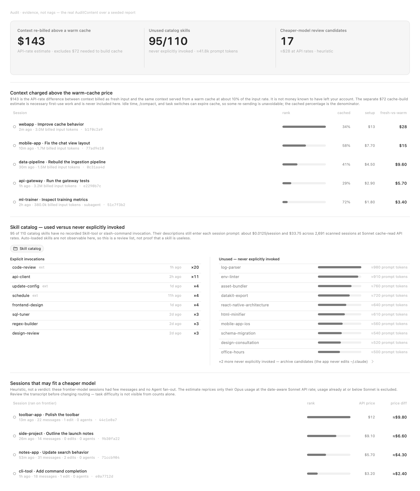
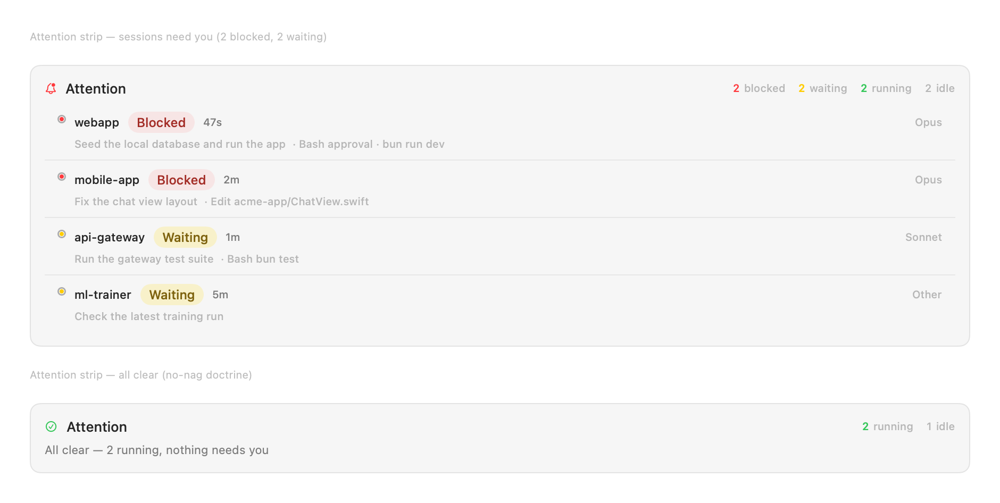
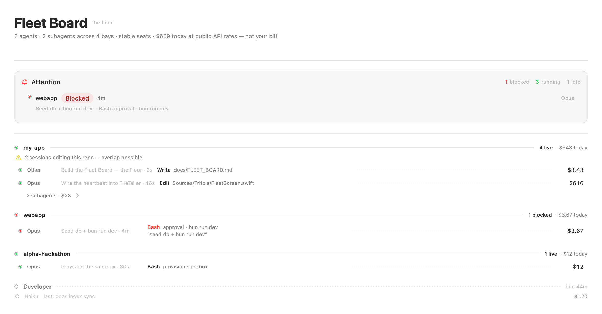

<div align="center">

# trifola

**The command center for your whole Claude Code fleet.**
Reads your local `~/.claude`, keeps transcript analysis local, and tells you what your agents
cost you, where the spend is being wasted, and which one is blocked waiting on
you — across every machine.

<!-- Badges: wire real URLs at launch -->


<picture>
  <source media="(prefers-color-scheme: dark)" srcset="docs/screenshots/audit-dark.png">
  
</picture>

_A truffle pig for your agent fleet: it sniffs out the valuable — and the
wasteful — hidden in data Claude Code already writes to disk. (Demo data — trifola
renders every screenshot from synthetic fixtures; your real `~/.claude` never leaves your machine.)_

</div>

---

## Why trifola

Claude Code made running 5–10 agents at once normal. Two failure modes came with it,
and nothing on your machine surfaces either:

- **You can't see where the money goes.** `/usage` shows a total. It won't tell you
  that a chunk of that total was **fresh input a warm cache would have served at a tenth
  the price**, that a run went to **Opus when Sonnet was configured**, or that your
  subagents **silently inherited the wrong model**. trifola attributes spend to a
  **cause**, not a number — and prices your *next* message warm-vs-cold before you send it.
- **You can't see who's stuck.** Agent #7 has been blocked on a `y/N` for forty minutes
  and you'd never know. trifola watches recent top-level sessions and flags **BLOCKED /
  needs-approval / silently-stalled** the moment it happens — in the menu bar, all day,
  and across every machine you run on.

It analyzes what Claude Code already writes to `~/.claude`. **No Trifola account, no
Trifola cloud, no telemetry. Source-auditable.** Idle CPU is ~0% in typical use.

## What it does

- 🟢 **Attention board** — every session as BLOCKED / WAITING / RUNNING / IDLE, worst-first,
  in a menu-bar glance.
- 🧾 **Cost-cause audit** — **re-sent context** vs unavoidable first-touch (never summed into one
  dishonest number), the "$20 hey" wasted-resend tax, Opus-on-lint, per-session receipts.
- 🧭 **Routing forensics** — silent model fallbacks and subagents that inherited the wrong model, with the
  exact fix you can paste into `CLAUDE.md`.
- 🧹 **Config hygiene** — which of your skills never fire, priced as the per-session tax they
  levy on every run.
- 📉 **Context tax** — what your next message costs warm vs cold, at your session's own rates.
- 🌐 **Whole fleet (experimental)** — consolidate manually configured machines over your own Tailscale.
- 🔌 **Agent-facing MCP (preview)** — a manually registered server so a *running* session can ask trifola about its
  own cost, routing, and quota mid-flight. Your agent can audit itself.
- 📅 **Quota windows** — your real plan windows, read-only.

<p align="center">
  <picture>
    <source media="(prefers-color-scheme: dark)" srcset="docs/screenshots/attention-dark.png">
    
  </picture>
  <br><em>The attention strip — the door light. BLOCKED / WAITING on you at a glance; a calm all-clear when nothing needs you.</em>
</p>

<p align="center">
  <picture>
    <source media="(prefers-color-scheme: dark)" srcset="docs/screenshots/fleet-dark.png">
    
  </picture>
  <br><em>The Fleet Board — every agent and subagent across bays, stable seats, live presence, spend per bay.</em>
</p>

## Install

**Fastest — see your own numbers, nothing to install:**

```bash
npx trifola
```

Reads your local `~/.claude`, prints your dead-skill count and wasted-resend audit, uploads
nothing. Runs anywhere Node does — macOS, Linux, WSL.

**The macOS app** (menu-bar attention board + live dashboard) — build from source:

```bash
git clone https://github.com/ss251/trifola.git
cd trifola
swift build -c release
bash Scripts/make-app.sh      # → dist/trifola.app
open dist/trifola.app
```

Requires macOS 15+ and a Swift 6 toolchain. Zero external dependencies.

> **On signing:** trifola is an indie project without a paid Apple Developer certificate, so
> pre-built downloads aren't notarized. **Building from source (above) runs with no warnings.**
> If you download an unsigned `.app` from Releases, clear the quarantine flag once:
> `xattr -dr com.apple.quarantine trifola.app`. A notarized DMG + Homebrew cask land if/when the
> project can fund a certificate.

## Your agent can audit itself (MCP)

trifola ships an MCP server in **preview**. It never mutates `~/.claude` or an external
system, though it maintains an app-local session index in Application Support. Build it and
register the resulting binary manually:

```bash
swift build -c release
claude mcp add trifola -- "$PWD/.build/release/Trifola" --mcp
```

Point a Claude Code session at it and the session
can introspect its own state — `session_brief`, `context_tax`, `reroutes`, `cost_today`,
`quota_windows`. Ask *"what will my next message cost warm vs cold?"* or *"am I about to
violate my routing policy?"* — mid-run, before it costs you. Tools that accept `session_id`
also allow it to be omitted; trifola then resolves the newest top-level session, which is
usually the caller.

## trifola vs. the neighbors (honestly)

trifola doesn't replace the cost bars or the native agent view — it does the layer they don't.

| | **trifola** | Claude Code **Agent View** | **ccusage / CodexBar** |
|---|:---:|:---:|:---:|
| "Which agent needs me now" | ✅ menu-bar + **cross-machine** | ✅ native, in-CLI, **single machine** | ❌ |
| Cost **cause** (re-sent vs first-touch, misroute) | ✅ | ❌ no cost in-view | 〜 totals only |
| Dead-skill / config hygiene | ✅ | ❌ | ❌ |
| Cross-machine fleet | 🧪 experimental (manual config) | ❌ single machine | ❌ |
| Agent-facing MCP (self-introspection) | 🧪 preview (manual registration) | ❌ local `--json` | ❌ |
| Local-first, uploads nothing | ✅ | ✅ | ✅ |

**Agent View** (native, free, in your CLI) does the live single-machine attention board well —
if that's all you need, use it. **ccusage** and **CodexBar** are excellent ambient cost bars.
trifola is the **audit + judgment layer over your whole fleet**: the *cause* of the spend, the
routing and skill hygiene, and every machine at once.

## Privacy and data flow

No Trifola account. No Trifola cloud. No telemetry. Trifola never sends transcript content
to Anthropic, models.dev, Linear, or any Trifola-operated service. Transcript analysis stays
on your machine; experimental cross-machine mode can copy transcript files only between the
machines you manually configure.

| Destination | Trigger | Data sent | How to disable |
|---|---|---|---|
| Anthropic quota API | **Automatic** when a readable Claude Code OAuth credential exists | OAuth access credential in the authorization header and standard HTTP request metadata; no transcripts | Sign out of Claude Code or otherwise make its credential unavailable; quota windows then degrade to unavailable |
| models.dev | **Opt-in** when you click **Refresh from models.dev** in the pricing view | A plain GET for the public pricing catalog; no credentials or transcripts | Do not use the refresh action; bundled pricing remains available offline |
| Manually configured SSH/Tailscale host | **Only if configured** in experimental cross-machine settings | SSH connection metadata and bounded transcript path-list requests; matching transcript files are pulled from that machine into Trifola's local mirror | Remove or disable the configured machine |
| Linear | **Opt-in** after adding a Linear key and choosing **Sync to Linear** | Confirmed deadline/project names, descriptions, target dates, and status updates; no transcripts | Do not connect/sync Linear, or remove the key |

The npm CLI is narrower: it reads local files only, opens no network connection, and uploads
nothing. The source is here—please audit it.

## Contributing

Rules, detectors, and fixes are the point — see [CONTRIBUTING.md](CONTRIBUTING.md).
**AI-assisted PRs are welcome.** Bring a failure mode, a threshold, and a fix template.

## Related projects

- [ccusage](https://github.com/ryoppippi/ccusage) — cross-platform token/cost totals from local data.
- [CodexBar](https://github.com/steipete/CodexBar) — every AI coding limit, in your menu bar.
- Claude Code **Agent View** — the native in-CLI live agent board.

## License

[MIT](LICENSE).
